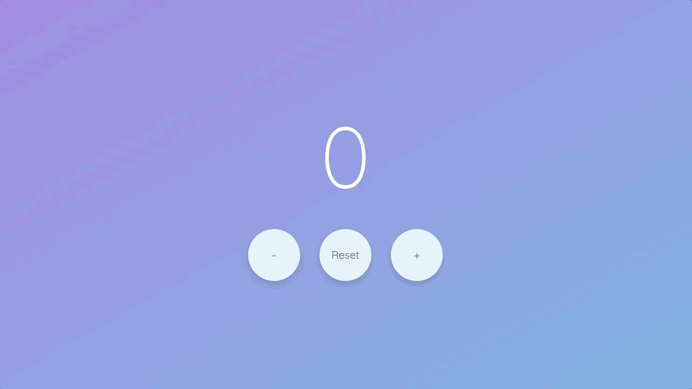

# JavaScript Counter Project

> Project #1 of [The Modern JavaScript Masterclass](https://github.com/codingcourses/modern-javascript-masterclass).

In this project, we will be learning about the basics of JavaScript on the web, HTML, CSS, and the
model-view-controller (MVC) design pattern, which will be the framework used for subsequent
projects in this course.

## Learning Goals

These are specific topics covered in this project:

- JavaScript on the web, DOM manipulation
- HTML, CSS
- MVC design pattern
- Publishing on GitHub Pages
